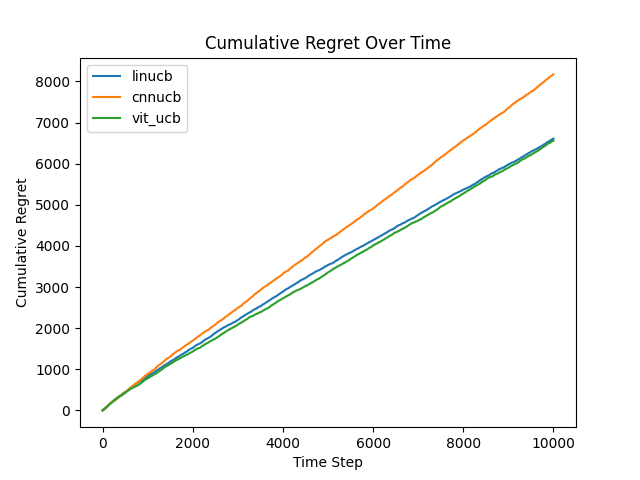
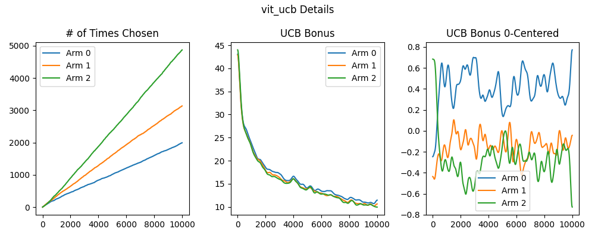
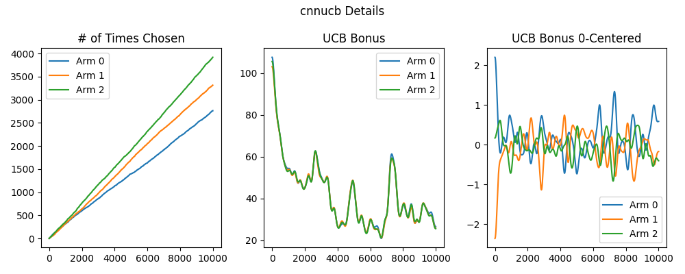
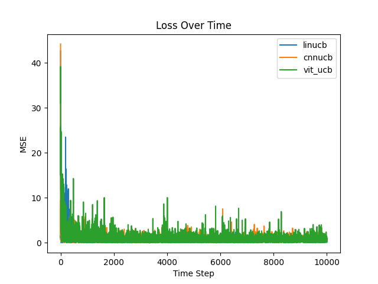

# Anime Results
This directory contains the results of the ViT-UCB algorithm and baselines on experiment 2 of the paper. The experiment consists of contextual bandits with $`K=3`$ arms and $`T=10000`$ rounds. The images are 10000 anime thumbnails pulled from popular anime database [MyAnimeList](https://myanimelist.net/), via the Jikan API. The animes are sorted by their rating and partitioned into 3 groups, numbered $`i=0\ldots2`$. For example, if the animes have ratings $`\{7.2, 2.6, 4.4, 5.3, 9.1, 8.3\}`$, group 0 would consist of $\{2.6, 4.4\}$; group 1 would consist of $`\{5.3, 7.2\}`$; group 2 would consist of $`\{8.3, 9.1\}`$. At each time step, arm $`i`$ would uniformly sample a random thumbnail from group $`i`$. Arm $`i`$ will have reward sample from a normal distribution $`N(\text{mean rating of group } i, 1)`$. Following the previous example, the reward of group 1 would be sampled from $`N(6.25, 1)`$. The MyAnimeList database had the following means for each group: 5.5, 6.5, 7.4. This experiment mirrors a content-based recommender system, where the agent must estimate the reward of an item given its features.The experiments were conducted in the [experiment.ipynb](/experiment.ipynb) notebook.

## Results

### Cumulative Regret

The regret curves look less ideal, but ViTUCB still remains the best. This is expected because ViT's advantage in global context allows it to better relationship between a thumbnail and its corresponding rating. 

### Exploration Bonus

As seen from left-most subplot of the ViT details, ViTUCB once again picks the arm 2 the most times. And although subtle, we can see that arm 2's curve seem to concave up while those of other arms concave down, suggesting that the agent is prioritizing the best arm more and more. The exploration bonus also displays expected behavior, with arms being picked more having a lower exploration bonus.

### Reward Estimate Loss

Each model's reward estimate error. ViTUCB having the lowest loss show that it was able to capture the context-reward relationship better than CNNUCB and LinUCB.