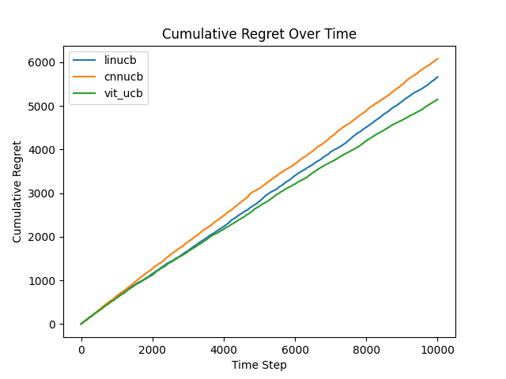
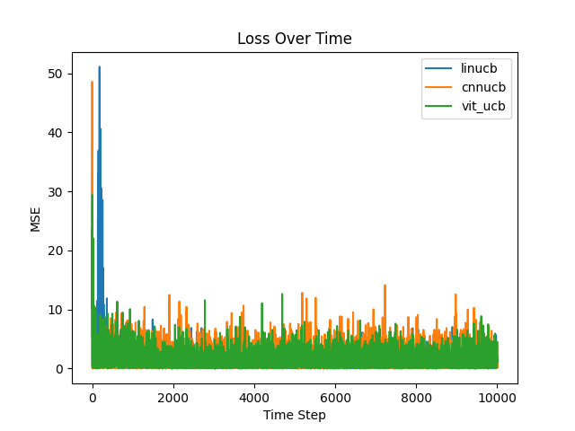

# Anime2 Results
This directory contains the results of the ViT-UCB algorithm and baselines on experiment 3 of the paper. This experiment is similar to the second (found [here](/anime%20results/)). However, the animes are not grouped. At each time step, $`K=3`$ animes are sampled and their thumbnails are shown to the agent as context. The reward for each action is sampled from $`N(\text{Rating of anime}, 1)`$. This iteration of experiment is more analogous to the experiments found in other contextual bandit literature. The experiments were conducted in the [experiment.ipynb](/experiment.ipynb) notebook.

## Results

### Cumulative Regret

The regret curves look less ideal, but ViTUCB still remains the best. This is expected because ViT's advantage in global context allows it to better relationship between a thumbnail and its corresponding rating. 

### Reward Estimate Loss

Each model's reward estimate error. ViTUCB having the lowest loss show that it was able to capture the context-reward relationship better than CNNUCB and LinUCB.