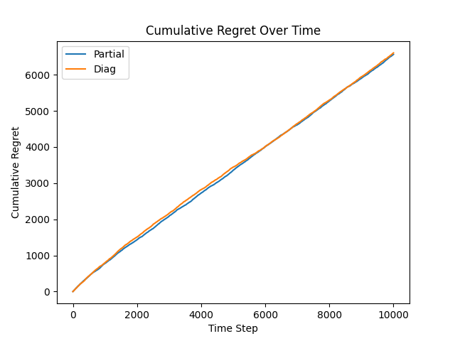
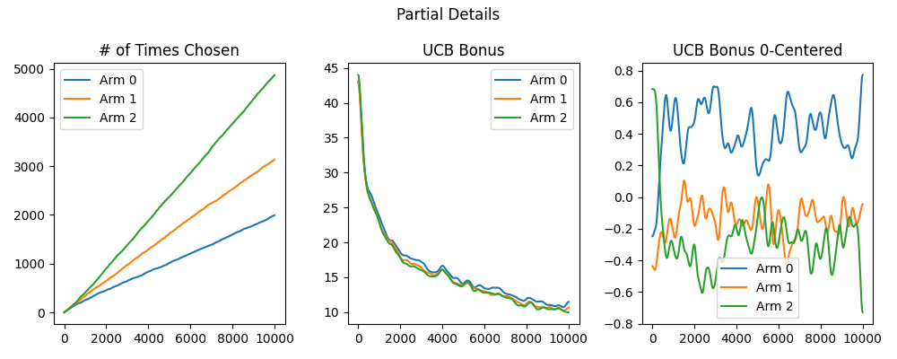
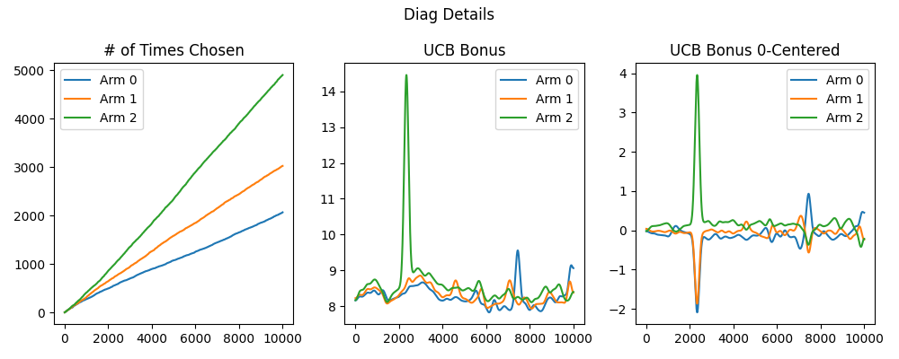

# Diag Results
This directory contains the results of comparing two methods for approximating $`A`$. The first way is to only track a portion of the gradient features. Recall the matrix $A$ is defined as $`A = \lambda I+ \sum_{t=1}^Tg_{t,a_t} g_{t,a_t}^\top`$. Instead of using the full $`g`$, we only use $`g_{t,a_t}(i:j)`$ where $`i:j`$ are the indices we choose to track, so $`A \approx \lambda I+ \sum_{t=1}^Tg_{t,a_t}(i:j) g_{t,a_t}(i:j)^\top`$. The other method is to only store the diagonal of the matrix. Looking at the recursive definition of $`A_t = A_{t-1}g_{t,a_t} g_{t,a_t}^\top`$, we can see that Sherman-Morrison formula can be used to update $`A^{-1}= A_{t-1}^{-1}
 - \frac{ A_{t-1}^{-1} g_{t,a_t}\, g_{t,a_t}^\top A_{t-1}^{-1} }
        { 1 + g_{t,a_t}^\top A_{t-1}^{-1} g_{t,a_t} }$. Storing only the diagonal, we have $d_t
= d_{t-1}
 - \frac{ (d_{t-1} \odot g)^{\circ 2} }
        { 1 + g^\top (d_{t-1} \odot g) }`$. 

The two methods were compared on experiment 2

## Results

The figure above shows that the two ways of approximating $`A`$ yields similar regret.

However, the details reveal that the exploration bonus of storing only diagonals is quite noisy. 

Therefore, the paper focuses on method 1 for approximating $`A`$.