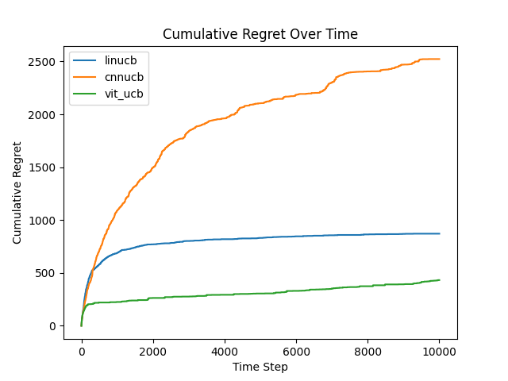
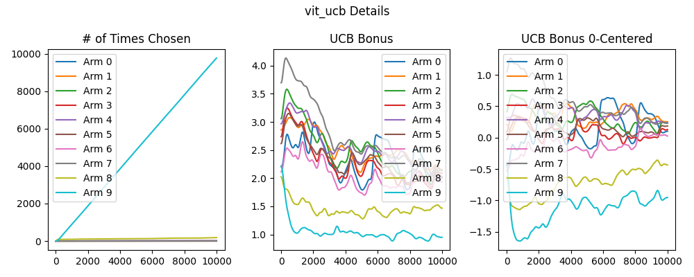
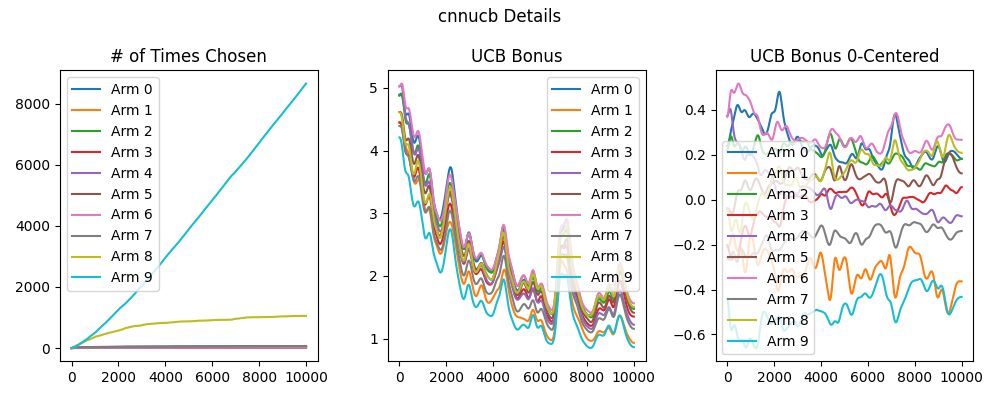
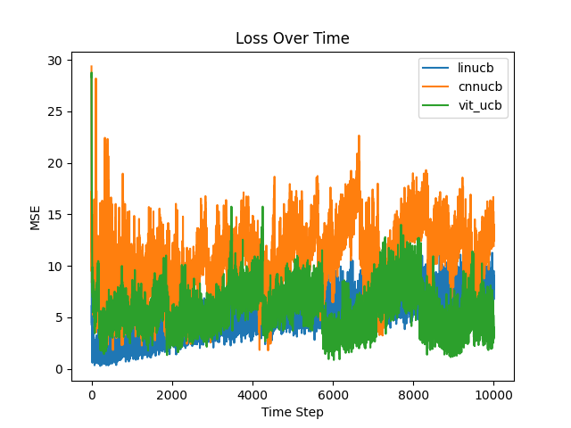

# MNIST Results
This directory contains the results of the ViT-UCB algorithm and baselines on experiment 1 of the paper. The experiment is contextual bandits with $`K=10`$ arms and $`T=10000`$ rounds. The image dataset used is a collection of handwritten digits from  [this dataset](https://www.kaggle.com/datasets/jcprogjava/handwritten-digits-dataset-not-in-mnist), with each digit consisting approximately 10000 images. Each arm were numbered from $`i=0\ldots9`$. Arm $`i`$ will have context images of the handwritten digit $`i`$. At each time step, each arm would uniformly sample a random image from their respective digit images. Arm $i$ will have reward sampled from a normal distribution $`N(i, 9)`$. See figure below for a visualization of the experiment. The experiments were conducted in the [experiment.ipynb](/experiment.ipynb) notebook.

## Results

### Cumulative Regret

All 3 algorithms achieved $`\tilde O (\sqrt T)`$ looking regret curves, suggesting that all algorithms were able to learn the optimal policy. It is surprising that CNNUCB performed much worse than the other two algorithms on this task, given that CNNs have proven to have really strong performances in handwritten digit classification. This performance gap likely stems from the difficulty of training the CNN feature extractor from scratch under high-variance Gaussian reward noise, whereas ViTUCB benefits from stable, pre-trained representations. 

### Exploration Bonus

Comparing figures above shows details of why CNNUCB failed. CNNUCB continued to pick arm 8 after the initial attempts while ViTUCB essentially picked arm 9 exclusively (recall that arm $i$ has expected value of $i$). The middle and right-most subplots of figure \ref{fig:e1_cnn} show that exploration bonus for arm 8 is unusually high, leading to its high pick rate. In contrast, figure \ref{fig:e1_detail} shows that ViTUCB's exploration bonuses more aligned with our expectations.

### Reward Estimate Loss

Each model's reward estimate error. ViTUCB having the lowest loss show that it was able to capture the context-reward relationship better than CNNUCB and LinUCB.