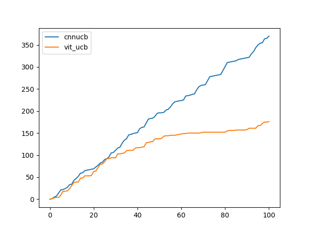
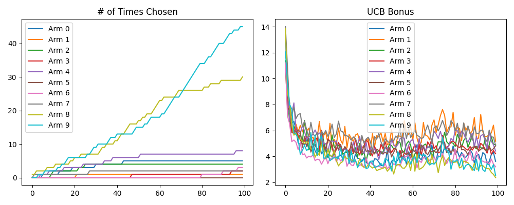

# Preliminary Results
This directory contains the preliminary results of the ViT-UCB algorithm on a test environment as a proof of concept. The dataset used is handwritten digits from [this dataset](https://www.kaggle.com/datasets/jcprogjava/handwritten-digits-dataset-not-in-mnist), where each arm corresponds to images of each digit, with STD=3. For example, arm 5 has contexts of handwritten 5s and the rewards are pulled from $`N(5, 3^2)`$. The experiments were conducted in the [experiment.ipynb](/experiment.ipynb) notebook.

## Results

The results show that ViTUCB is a viable contextual bandits algorithm. The hyperparameters are not yet tuned so the performance between CNNUCB and ViTUCB shouldn't be compared.

### Cumulative Regret

We can see that the ViTUCB was able to achieve a logarithmic-shaped regret, meaning that the agent was able to learn the optimal policy

### Exploration Bonus

The graph shows the number times each arm was picked and its exploration bonus over time. As we can see, arm 8 and 9 had the highest count and they had the lowest exploration bonus, as intended